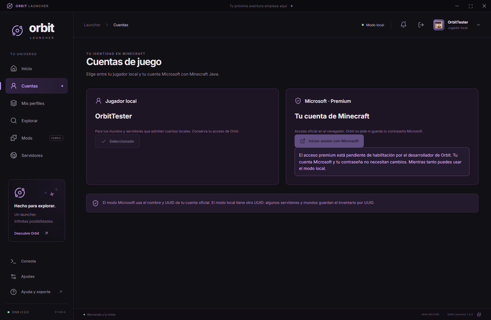
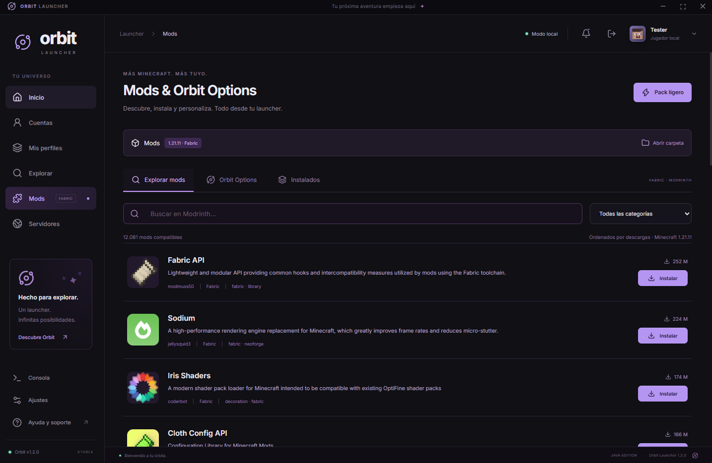
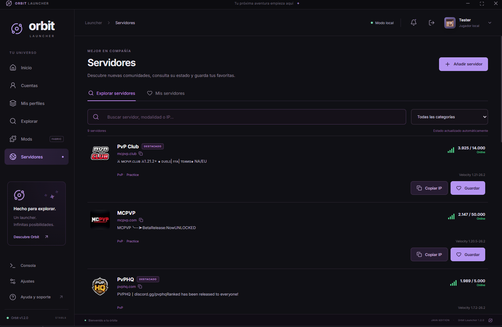

# Orbit Launcher

Orbit Launcher is an independent Windows desktop launcher for **Minecraft: Java Edition**.

Its goal is to provide a clean, modern launcher experience with profile management, Vanilla and Fabric support, mod management, Java runtime handling, Minecraft server status, Orbit PvP/HUD modules, and optional Microsoft account authentication for users who already own Minecraft: Java Edition.

> **Disclaimer:** Orbit Launcher is an independent project and is not affiliated with, endorsed by, or sponsored by Mojang Studios or Microsoft.

---

## Current version

**Orbit Launcher 1.2.0**

Orbit Launcher is currently under active development. Features, interfaces, and supported versions may change between releases.

---

## Development status

### Microsoft authentication status

| Component                                     | Status |
|---|---|
| Microsoft OAuth 2.0 Device Code Flow       | ✅ Implemented |
| Xbox Live authentication                   | ✅ Implemented |
| XSTS authentication                        | ✅ Implemented |
| Minecraft entitlement verification logic   | ✅ Implemented |
| Minecraft Java profile retrieval logic     | ✅ Implemented |
| Minecraft Services AppID approval          | ⏳ Pending review |
| End-to-end Premium login                   | ⏳ Pending AppID approval |

The Orbit Launcher Microsoft Application ID has been submitted for review so that legitimate Minecraft owners can authenticate through the official Minecraft Services flow.

Until that approval is completed, Microsoft/Premium authentication may not be available in public builds.

---

## Main features

- Minecraft: Java Edition launcher for Windows
- Vanilla and Fabric profiles
- Independent game instances per profile
- Automatic Java runtime handling
- RAM, resolution, fullscreen, and performance settings
- Fabric mod discovery and installation
- Integrated Modrinth browsing
- Built-in Orbit PvP/HUD modules
- Minecraft server discovery, status, player count, and ping
- Local/offline profile mode for compatible environments
- Microsoft account authentication for legitimate Minecraft owners
- Encrypted local storage for Microsoft session data through Electron `safeStorage`
- Multiple profile support
- Separate game directories per profile
- Orbit-specific launcher UI and settings

---

## Supported Minecraft versions

Orbit currently focuses on:

- **Minecraft Java Edition 1.21.1**
- **Minecraft Java Edition 1.21.11**
- Vanilla profiles
- Fabric profiles

Additional Minecraft versions may be supported as development continues.

---

## Technology

Orbit Launcher is built with:

- **Electron**
- **React**
- **TypeScript**
- **Node.js**
- **Fabric Loader**
- **Java 21** for supported modern Minecraft versions
- **Microsoft OAuth 2.0**
- **Xbox Live / XSTS authentication**
- **Minecraft Services**
- **Modrinth integration**

---

## Microsoft authentication

Orbit Launcher uses the Microsoft OAuth 2.0 **Device Authorization Grant**.

The intended authentication flow is:

```text
Orbit Launcher
      ↓
Microsoft OAuth
      ↓
Xbox Live
      ↓
XSTS
      ↓
Minecraft Services
      ↓
Minecraft ownership verification
      ↓
Minecraft Java profile
```

Orbit Launcher does **not** ask for or store the user's Microsoft password.

The password is entered only on Microsoft's official sign-in pages.

Orbit stores the resulting session locally using operating-system protected encryption where available.

### Microsoft Entra application

- **Application name:** `Orbit Launcher`
- **Application type:** Public desktop client
- **Authentication method:** Device Code Flow
- **Application (Client) ID:** `3adf926a-f972-44c2-a889-24874af484ba`
- **Client secret:** Not used

No client secret is embedded in the launcher.

---

## Minecraft ownership and account requirements

Orbit Launcher is designed for users who already own **Minecraft: Java Edition** or otherwise have a valid entitlement through their Microsoft account.

Before using an authenticated Microsoft profile, Orbit is designed to:

1. authenticate the user through Microsoft;
2. authenticate with Xbox Live;
3. obtain XSTS authorization;
4. authenticate with Minecraft Services;
5. verify Minecraft ownership/entitlements;
6. retrieve the user's official Minecraft Java Edition profile.

Orbit is **not** intended to bypass:

- Minecraft authentication;
- ownership checks;
- subscriptions;
- account restrictions;
- bans;
- server authentication requirements;
- server rules;
- any other access controls.

---

## Screenshots

### Home


### Microsoft account integration



### Mods & Fabric integration



### Minecraft servers



---

## Orbit PvP / HUD

Orbit includes its own configurable PvP and HUD module system for supported Fabric versions.

Development currently focuses on modules such as:

- FPS
- CPS
- PvP information
- Reach display
- Combo counter
- Attack indicator
- Armor status
- Item counter
- Totem counter
- Potion effects
- Saturation
- Hitboxes
- KeyStrokes
- Crosshair
- Hit color
- Particle customization
- Hurt camera controls
- Fire height
- FOV controls
- HUD overlay customization

Some modules remain under active development and may change before a stable release.

---

## Roadmap

### Completed / implemented

- Windows desktop launcher interface
- Minecraft profile management
- Vanilla and Fabric support
- Automatic Java runtime handling
- Independent game directories
- Mod browser and installation
- Modrinth integration
- Minecraft server status and ping
- Orbit HUD/PvP framework
- Microsoft OAuth Device Code Flow
- Xbox Live authentication
- XSTS authentication
- Minecraft entitlement/profile integration logic
- Local encrypted storage for Microsoft session data

### In progress

- Minecraft Services Application ID approval
- End-to-end Premium account authentication
- Orbit HUD editor improvements
- PvP module improvements
- UI polish and accessibility
- Installer and update experience

### Planned

- Automatic launcher updates
- Better profile backup and restore tools
- Expanded Minecraft version support
- Additional Orbit modules
- Improved account management
- Better diagnostics and recovery tools
- Signed Windows releases when distribution is ready

---

## Privacy

See [PRIVACY.md](PRIVACY.md).

Orbit Launcher does not require users to enter their Microsoft password inside the launcher.

Authentication credentials are entered only on Microsoft's official authentication pages.

---

## Security

See [SECURITY.md](SECURITY.md).

Please do **not** publish any of the following in GitHub issues:

- Microsoft passwords
- access tokens
- refresh tokens
- Xbox tokens
- XSTS tokens
- Minecraft access tokens
- device codes
- payment information
- private recovery information

---

## Microsoft / Minecraft application review

Additional information prepared for application review is available in:

[MICROSOFT-APP-REVIEW.md](MICROSOFT-APP-REVIEW.md)

---

## Support

For bugs or technical issues, open an issue in this repository.

When reporting a problem, include:

- Orbit Launcher version
- Windows version
- Minecraft version
- selected loader (Vanilla or Fabric)
- steps to reproduce the issue
- non-sensitive launcher logs when relevant

Never include authentication tokens or passwords.

---

## FAQ

### Does Orbit Launcher store my Microsoft password?

No. Microsoft credentials are entered only on Microsoft's official authentication pages.

### Do I need to own Minecraft Java Edition?

Yes for Microsoft/Premium mode. Orbit's authenticated Microsoft mode is intended for users with a valid Minecraft entitlement.

### Is Orbit Launcher affiliated with Mojang or Microsoft?

No. Orbit Launcher is an independent project and is not affiliated with, endorsed by, or sponsored by Mojang Studios or Microsoft.

### Can I use Fabric mods?

Yes. Orbit supports Fabric profiles and includes integrated mod management.

### Is Microsoft Premium login available?

The authentication implementation is present, but the Orbit Launcher Application ID is currently pending Minecraft Services approval. End-to-end Premium login depends on that approval.

### Does Orbit include a local mode?

Yes. Orbit also includes a local/offline profile mode intended for compatible environments. It does not replace official authentication on servers that require Microsoft/Minecraft authentication.

### Does Orbit bypass Minecraft ownership checks?

No. Orbit is designed to verify ownership/entitlements through Minecraft Services when using Microsoft authentication.

---

## Usage guidelines

Orbit Launcher is intended to be used in accordance with the [Minecraft EULA](https://www.minecraft.net/eula) and the [Minecraft Usage Guidelines](https://aka.ms/mcusageguidelines).

Users remain responsible for complying with the rules of the servers and services they access.

---

## Repository purpose

This repository currently hosts public project documentation, screenshots, privacy information, security information, and materials relevant to Microsoft/Minecraft application review.

Source-code availability may change as the project evolves.

---

## Project status

Orbit Launcher is currently under active development.

Features and interfaces may change between releases.

---

## License / trademarks

Minecraft, Mojang, Microsoft, Xbox, Fabric, Modrinth, and other referenced names and marks belong to their respective owners.

Orbit Launcher does not claim ownership of third-party trademarks.

