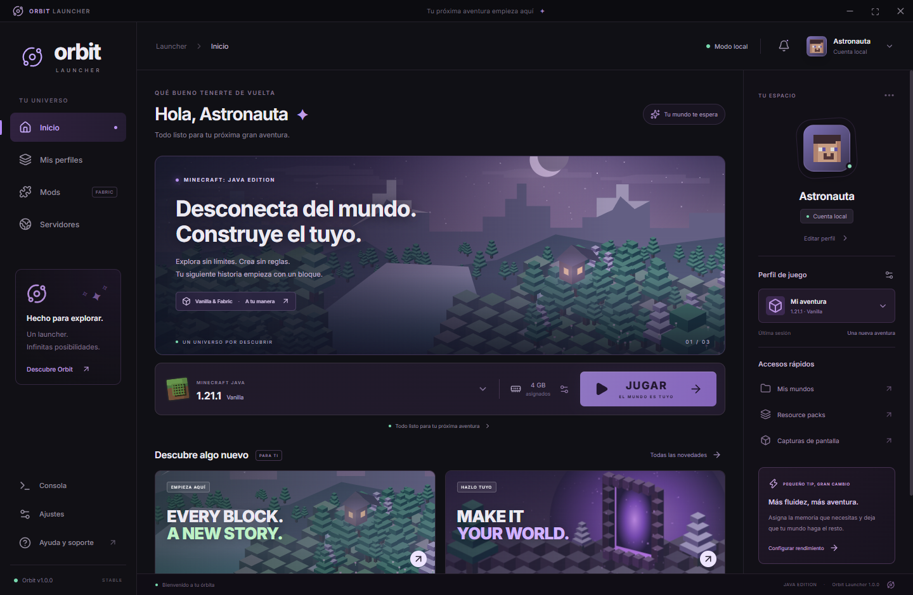

# Orbit Launcher

Orbit Launcher is an independent Windows desktop launcher for **Minecraft: Java Edition**.

Its goal is to provide a clean launcher experience with profile management, Fabric support, mod management, Java runtime handling, Minecraft server status, and optional Microsoft account authentication for users who already own Minecraft: Java Edition.

> Orbit Launcher is an independent project and is not affiliated with, endorsed by, or sponsored by Mojang Studios or Microsoft.

## Current version

**Orbit Launcher 1.2.0**

## Main features

- Minecraft: Java Edition launcher for Windows
- Vanilla and Fabric profiles
- Independent game instances per profile
- Automatic Java runtime handling
- RAM, resolution and performance settings
- Fabric mod management
- Built-in Orbit PvP/HUD modules
- Minecraft server status and ping
- Local/offline profile mode for compatible environments
- Microsoft account authentication for legitimate Minecraft owners
- Encrypted local storage for Microsoft session data through Electron safeStorage

## Microsoft authentication

Orbit Launcher uses the Microsoft OAuth 2.0 **Device Authorization Grant**.

The authentication flow is:

```text
Orbit Launcher
      ↓
Microsoft OAuth
      ↓
Xbox Live
      ↓
XSTS
      ↓
Minecraft Services
      ↓
Minecraft ownership verification
      ↓
Minecraft Java profile
```

Orbit Launcher does **not** ask for or store the user's Microsoft password.

The password is entered only on Microsoft's official sign-in pages.

Orbit stores the resulting session locally using operating-system protected encryption where available.

### Microsoft Entra application

- Application name: `Orbit Launcher`
- Application type: Public desktop client
- Authentication method: Device Code Flow
- Application (Client) ID: `3adf926a-f972-44c2-a889-24874af484ba`

No client secret is embedded in the launcher.

## Minecraft ownership

Orbit Launcher is designed for users who already own Minecraft: Java Edition or otherwise have a valid entitlement through their Microsoft account.

Before using an authenticated profile, Orbit verifies Minecraft ownership and obtains the official Minecraft profile from Minecraft Services.

Orbit is not intended to bypass Minecraft authentication, ownership checks, subscriptions, bans, server restrictions, or any other access controls.

## Screenshots

Add screenshots of Orbit Launcher inside the `assets/` folder and reference them here.

Suggested screenshots:

- `assets/home.png`
- `assets/accounts.png`
- `assets/profiles.png`
- `assets/mods.png`

Example:

```md

```

## Privacy

See [PRIVACY.md](PRIVACY.md).

## Security

See [SECURITY.md](SECURITY.md).

## Support

For bugs or technical issues, open an issue in this repository.

## Usage guidelines

Orbit Launcher is intended to be used in accordance with the Minecraft EULA and Minecraft Usage Guidelines.

Users remain responsible for complying with the rules of the servers and services they access.

## Project status

Orbit Launcher is currently under active development.

Features and interfaces may change between releases.
